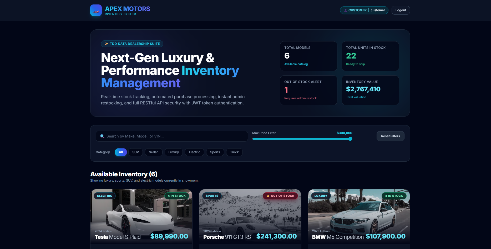
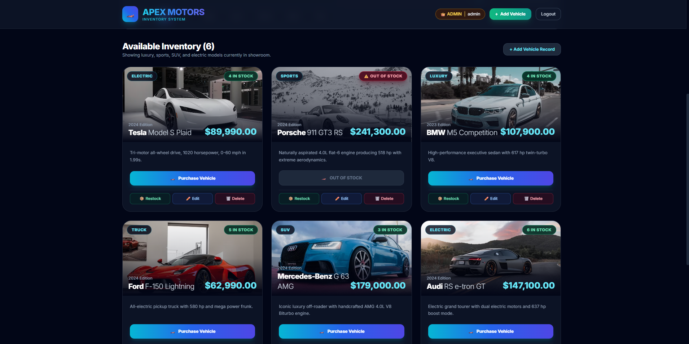
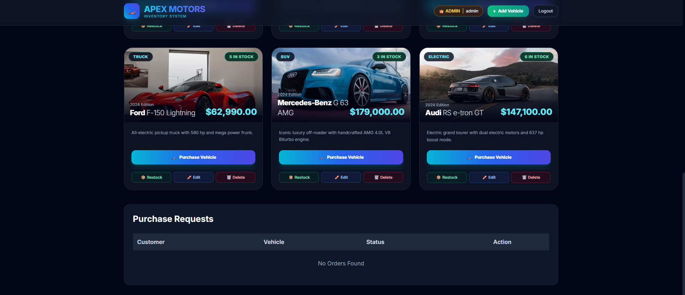
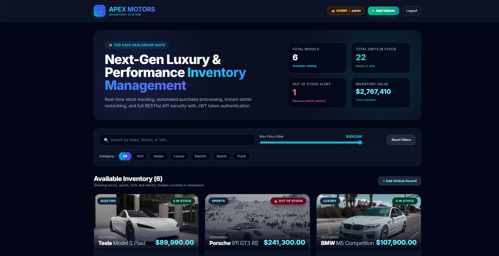

# 🏎️ Car Dealership Inventory System

A full-stack Car Dealership Inventory Management System built using **Java Spring Boot**, **Spring Security with JWT Authentication**, **Spring Data JPA**, **MySQL**, and **React (Vite) + Tailwind CSS**.

> **Repository:** https://github.com/Pratyush-xxvi/Incubyte_assessment

---

# 🌟 Features

## Backend

- JWT Authentication (Register/Login)
- Role-Based Authorization (Admin & Customer)
- Vehicle CRUD Operations
- Vehicle Purchase
- Vehicle Restock
- Order Management (Approve/Reject Orders)
- Vehicle Search & Filtering
- RESTful APIs
- Environment Variable Configuration

## Frontend

- React + Vite Single Page Application
- Responsive User Interface
- Customer Dashboard
- Admin Dashboard
- Purchase Modal
- Order Management Screen
- Vehicle Search & Filtering
- JWT Protected Routes

---

# 🛠 Technology Stack

| Layer | Technology |
|--------|------------|
| Backend | Java 17, Spring Boot 3 |
| Security | Spring Security, JWT |
| Database | MySQL |
| ORM | Spring Data JPA (Hibernate) |
| Frontend | React 18, Vite |
| Styling | Tailwind CSS |
| HTTP Client | Axios |

---

# 🚀 Project Setup

## Prerequisites

- Java 17+
- Maven
- Node.js (v18+)
- MySQL Server

---

## Backend Setup

### 1. Clone Repository

```bash
git clone https://github.com/Pratyush-xxvi/Incubyte_assessment.git

cd Incubyte_assessment/backend
```

### 2. Configure Environment Variables

Copy

```
.env.example
```

to

```
.env
```

Update the values:

```env
DB_URL=jdbc:mysql://localhost:3306/dealership
DB_USERNAME=your_username
DB_PASSWORD=your_password
JWT_SECRET=your_secret_key
```

### 3. Create MySQL Database

```sql
CREATE DATABASE dealership;
```

### 4. Run Backend

```bash
mvn clean install

mvn spring-boot:run
```

Backend runs on

```
http://localhost:8080
```

---

# Frontend Setup

```bash
cd ../frontend

npm install

npm run dev
```

Frontend runs on

```
http://localhost:3000
```

---

# 🔐 Demo Credentials

## Admin

```
Username : admin
Password : admin123
```

## Customer

```
Username : customer
Password : customer123
```

---

# 📸 Screenshots

## Customer Dashboard



---

## Vehicle List



---

## Admin Dashboard



---

## Admin Orders



---

# 📂 Project Structure

```
backend/
frontend/
screenshots/
README.md
PROMPTS.md
```

---

# 🧪 Testing

The following functionality was tested:

- User Registration
- User Login
- JWT Authentication
- Vehicle CRUD Operations
- Vehicle Search
- Purchase Vehicle
- Restock Vehicle
- Order Creation
- Order Approval
- Order Rejection
- Role-Based Authorization

---

# 🤖 AI Usage

## AI Tools Used

- ChatGPT
- Google Gemini

## How AI Was Used

AI was used to assist with:

- Spring Boot backend development
- Spring Security and JWT authentication
- REST API implementation
- React frontend development
- Order management workflow
- Debugging backend and frontend issues
- Documentation
- Environment variable configuration
- README preparation

## Reflection

AI accelerated development by assisting with backend implementation, frontend development, debugging, documentation, and project organization. All AI-generated suggestions were reviewed, tested, and modified before integration into the final project.

---

# 📄 Environment Variables

Backend

```
backend/.env.example
```

Frontend

```
frontend/.env.example
```

Copy both files to `.env` and update the values before running the project.

---

# 📝 Example Commit Format

```bash
git commit -m "feat: complete car dealership inventory system

Implemented JWT authentication, vehicle inventory management,
order workflow, frontend integration, documentation,
screenshots and environment configuration.

Co-authored-by: ChatGPT <AI@users.noreply.github.com>"
```

---

# 👨‍💻 Author

**Pratyush Jha**

GitHub Repository:

https://github.com/Pratyush-xxvi/Incubyte_assessment
